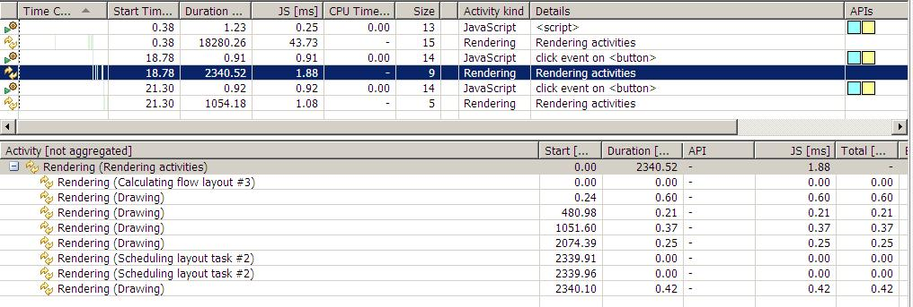

# HTML页面加载流程
>## 浏览器加载显示html的顺序
1. IE下载的顺序是从上到下，渲染的顺序也是从上到下，下载和渲染是同时进行的。
2.  在渲染到页面的某一部分时，其上面的所有部分都已经下载完成（并不是说所有相关联的元素都已经下载完）。
3. 如果遇到语义解释性的标签嵌入文件（JS脚本，CSS样式），那么此时IE的下载过程会启用单独连接进行下载。
4.  并且在下载后进行解析，解析过程中，停止页面所有往下元素的下载。
5.  样式表在下载完成后，将和以前下载的所有样式表一起进行解析，解析完成后，将对此前所有元素（含以前已经渲染的）重新进行渲染。
6. JS、CSS中如有重定义，后定义函数将覆盖前定义函数。


>## JS的加载
>1. 不能并行下载和解析（阻塞下载）
>2. 当引用了JS的时候，浏览器发送1个js request就会一直等待该request的返回。因为浏览器需要1个稳定的DOM树结构，而JS中很有可能有代码直接改变了DOM树结构，比如使用 document.write 或 a,甚至是直接使用的location.href进行跳转，浏览器为了防止出现JS修改DOM树，需要重新构建DOM树的情况，所以 就会阻塞其他的下载和呈现.


### 页面渲染就是浏览器将html代码根据css定义规则显示在浏览器窗口中的这个过程。先来大致了解一下浏览器都是怎么干活的：

>1. 用户输入网址（假设是个html页面，并且是第一次访问），浏览器向服务器发出请求，服务器返回html文件；
>2. 浏览器开始载入html代码，发现\<head>标签内有一个\<link>标签引用外部CSS文件；
>3. 浏览器又发出CSS文件的请求，服务器返回这个CSS文件；
>4. 浏览器继续载入html中\<body>部分的代码，并且CSS文件已经拿到手了，可以开始渲染页面了；
>5. 浏览器在代码中发现一个\标签引用了一张图片，向服务器发出请求。此时浏览器不会等到图片下载完，而是继续渲染后面 的代码；
>6. 服务器返回图片文件，由于图片占用了一定面积，影响了后面段落的排布，因此浏览器需要回过头来重新渲染这部分代码；
>7. 浏览器发现了一个包含一行Javascript代码的\<script>标签，赶快运行它；
>8. Javascript脚本执行了这条语句，它命令浏览器隐藏掉代码中的某个\<div> （style.display=”none”）。杯具啊，突然就少了这么一个元素，浏览器不得不重新渲染这部分代码；
>9. 终于等到了\</html>的到来，浏览器泪流满面……
>10. 等等，还没完，用户点了一下界面中的“换肤”按钮，Javascript让浏览器换了一下\<link>标签的CSS路径；
>11. 浏览器召集了在座的各位\<div>\<span>\<ul>\<li>们，“大伙儿收拾收拾 行李，咱得重新来过……”，浏览器向服务器请求了新的CSS文件，重新渲染页面。


# 浏览器渲染页面DOM结构

>1. 浏览器把获取到的HTML代码解析成1个DOM树，HTML中的每个tag都是DOM树中的1个节点，根节点就是我们常用的document对象。DOM树里包含了所有HTML标签，包括display:none隐藏，还有用JS动态添加的元素等。
>2. 浏览器把所有样式(用户定义的CSS和用户代理)解析成样式结构体，在解析的过程中会去掉浏览器不能识别的样式，比如IE会去掉-moz开头的样式，而FF会去掉_开头的样式。
>3. DOM Tree 和样式结构体组合后构建render tree, render tree类似于DOM tree，但区别很大，render tree能识别样式，render tree中每个NODE都有自己的style，而且 render tree不包含隐藏的节点 (比如display:none的节点，还有head节点)，因为这些节点不会用于呈现，而且不会影响呈现的，所以就不会包含到 render tree中。注意 visibility:hidden隐藏的元素还是会包含到 render tree中的，因为visibility:hidden 会影响布局(layout)，会占有空间。根据CSS2的标准，render tree中的每个节点都称为Box (Box dimensions)，理解页面元素为一个具有填充、边距、边框和位置的盒子。
>4. 一旦render tree构建完毕后，浏览器就可以根据render tree来绘制页面了。

# 回流与重绘
* 当render tree中的一部分(或全部)因为元素的规模尺寸，布局，隐藏等改变而需要重新构建。这就称为回流(reflow)。每个页面至少需要一次回流，就是在页面第一次加载的时候。在回流的时候，浏览器会使渲染树中受到影响的部分失效，并重新构造这部分渲染树，完成回流后，浏览器会重新绘制受影响的部分到屏幕中，该过程成为重绘。
* 当render tree中的一些元素需要更新属性，而这些属性只是影响元素的外观，风格，而不会影响布局的，比如background-color。则就叫称为重绘。

> 注意：回流必将引起重绘，而重绘不一定会引起回流。

## 什么操作会引起重绘、回流
* 其实任何对render tree中元素的操作都会引起回流或者重绘，比如：

>1. 添加、删除元素(回流+重绘)
>2. 隐藏元素，display:none(回流+重绘)，visibility:hidden(只重绘，不回流)
>3. 移动元素，比如改变top,left(jquery的animate方法就是,改变top,left不一定会影响回流)，或者移动元素到另外1个父元素中。(重绘+回流)
>4. 对style的操作(对不同的属性操作，影响不一样)
>5. 还有一种是用户的操作，比如改变浏览器大小(回流+重绘) 
>6. 改变浏览器的字体大小等(回流+重绘) 
>7. 元素尺寸改变——边距、填充、边框、宽度和高度
>8. 内容改变——比如文本改变或者图片大小改变而引起的计算值宽度和高度改变；
>9. 页面渲染初始化；
>10. 增加或者移除样式表
>11. 内容变化，比如用户在input框中输入文字
>12. 激活 CSS 伪类，比如 :hover (IE 中为兄弟结点伪类的激活)
>13. 操作 class 属性
>14. 脚本操作 DOM
>15. 计算 offsetWidth 和 offsetHeight 属性

#### 让我们看看下面的代码是如何影响回流和重绘的: 

```
var s = document.body.style; 

s.padding = "2px"; // 回流+重绘
s.border = "1px solid red"; // 再一次 回流+重绘

s.color = "blue"; // 再一次重绘
s.backgroundColor = "#ccc"; // 再一次 重绘

s.fontSize = "14px"; // 再一次 回流+重绘

// 添加node，再一次 回流+重绘
document.body.appendChild(document.createTextNode('abc!'));
```
+ 请注意我上面用了多少个再一次。

>说到这里大家都知道回流比重绘的代价要更高，回流的花销跟render tree有多少节点需要重新构建有关系，假设你直接操作body，比如在body最前面插入1个元素，会导致整个render tree回流，这样代价当然会比较高，但如果是指body后面插入1个元素，则不会影响前面元素的回流。

## 聪明的浏览器
+ 从上个实例代码中可以看到几行简单的JS代码就引起了6次左右的回流、重绘。而且我们也知道回流的花销也不小，如果每句JS操作都去回流重绘的话，浏览器可能就会受不了。所以很多浏览器都会优化这些操作，浏览器会维护1个队列，把所有会引起回流、重绘的操作放入这个队列，等队列中的操作到了一定的数量或者到了一定的时间间隔，浏览器就会把flush队列，进行一个批处理。这样就会让多次的回流、重绘变成一次回流重绘。

+ 虽然有了浏览器的优化，但有时候我们写的一些代码可能会强制浏览器提前flush队列，这样浏览器的优化可能就起不到作用了。当你请求向浏览器请求一些style信息的时候，就会让浏览器flush队列，比如：

>1. offsetTop, offsetLeft, offsetWidth, offsetHeight
>2. scrollTop/Left/Width/Height
>3. clientTop/Left/Width/Height
>4. width,height
>5. 请求了getComputedStyle(), 或者 ie的 currentStyle

+ 当你请求上面的一些属性的时候，浏览器为了给你最精确的值，需要flush队列，因为队列中可能会有影响到这些值的操作。

## 如何减少回流、重绘
+ 减少回流、重绘其实就是需要减少对render tree的操作，并减少对一些style信息的请求，尽量利用好浏览器的优化策略。具体方法有：

1、不要1个1个改变元素的样式属性，最好直接改变className，但className是预先定义好的样式，不是动态的，如果你要动态改变一些样式，则使用cssText来改变，见下面代码：

```
// 不好的写法
var left = 1;
var top = 1;
el.style.left = left + "px";
el.style.top  = top  + "px";

// 比较好的写法 
el.className += " className1";

// 比较好的写法 
el.style.cssText += "; left: " + left + "px; top: " + top + "px;";
```


2、让要操作的元素进行"离线处理"，处理完后一起更新，这里所谓的"离线处理"即让元素不存在于render tree中，比如：<br/>
> 1） 使用documentFragment或div等元素进行缓存操作，这个主要用于添加元素的时候，大家应该都用过，就是先把所有要添加到元素添加到1个div(这个div也是新加的)，最后才把这个div append到body中。<br/>
> 2) 先display:none 隐藏元素，然后对该元素进行所有的操作，最后再显示该元素。因对display:none的元素进行操作不会引起回流、重绘。所以只要操作只会有2次回流。<br/>
> 3）使用cloneNode(true or false) 和 replaceChild 技术，引发一次回流和重绘；

3、不要经常访问会引起浏览器flush队列的属性，如果你确实要访问，就先读取到变量中进行缓存，以后用的时候直接读取变量就可以了，见下面代码：

```
// 别这样写，大哥
for(循环) {
    el.style.left = el.offsetLeft + 5 + "px";
    el.style.top  = el.offsetTop  + 5 + "px";
}

// 这样写好点
var left = el.offsetLeft,top  = el.offsetTop,s = el.style;
for(循环) {
    left += 10;
    top  += 10;
    s.left = left + "px";
    s.top  = top  + "px";
}
```

4、考虑你的操作会影响到render tree中的多少节点以及影响的方式，影响越多，花费肯定就越多。比如现在很多人使用jquery的animate方法移动元素来展示一些动画效果，想想下面2种移动的方法：

```
// block1是position:absolute 定位的元素，它移动会影响到它父元素下的所有子元素。
// 因为在它移动过程中，所有子元素需要判断block1的z-index是否在自己的上面，
// 如果是在自己的上面,则需要重绘,这里不会引起回流
$("#block1").animate({left:50});
// block2是相对定位的元素,这个影响的元素与block1一样，但是因为block2非绝对定位
// 而且改变的是marginLeft属性，所以这里每次改变不但会影响重绘，
// 还会引起父元素及其下元素的回流
$("#block2").animate({marginLeft:50});
```

## 实例测试
+ 最后用2个工具对上面的理论进行一些测试，分别是：dynaTrace(测试ie),Speed Tracer(测试Chrome)。
+ 第一个测试代码不改变元素的规则，大小，位置。只改变颜色，所以不存在回流，仅测试重绘，代码如下：

```
<body>
    <script type="text/javascript">
        var s = document.body.style;
        var computed;
        if (document.body.currentStyle) {
          computed = document.body.currentStyle;
        } else {
          computed = document.defaultView.getComputedStyle(document.body, '');
        }
 
    function testOneByOne(){
      s.color = 'red';;
      tmp = computed.backgroundColor;
      s.color = 'white';
      tmp = computed.backgroundImage;
      s.color = 'green';
      tmp = computed.backgroundAttachment;
    }
    
    function testAll() {
      s.color = 'yellow';
      s.color = 'pink';
      s.color = 'blue';
      
      tmp = computed.backgroundColor;
      tmp = computed.backgroundImage;
      tmp = computed.backgroundAttachment;
    }
    </script>    
    color test <br />
    <button onclick="testOneByOne()">Test One by One</button>
    <button onclick="testAll()">Test All</button>
</body>
```
+ testOneByOne 函数改变3次color,其中每次改变后调用getComputedStyle,读取属性值(按我们上面的讨论，这里会引起队列的 flush)，testAll 同样是改变3次color，但是每次改变后并不马上调用getComputedStyle。
+ 我们先点击Test One by One按钮，然后点击 Test All,用dynaTrace监控如下：


>上图可以看到我们执行了2次button的click事件，每次click后都跟一次rendering，2次click函数执行的时间都差不多, 0.25ms,0.26ms，但其后的rendering时间就相差一倍多。(其实很多时候，前端的性能瓶颈并不在于JS的执行，而是在于页面的呈现，这种情况在富客户端中更为突出)。我们再看图的下面部分，这是第一次rendering的详细信息，可以看到里面有2行是 Scheduleing layout task，这个就是我们前面讨论过的浏览器优化过的队列，可以看出我们引发2次的flush。


>再看第二次rendering的详细信息，可以看出并没有Scheduleing layout task,所以这次rendering的时间也比较短。

+ 测试代码2：这个测试跟第一次测试的代码很类似，但加上了对layout的改变，为的是测试回流。

```
<!DOCTYPE html PUBLIC "-//W3C//DTD XHTML 1.0 Transitional//EN" "http://www.w3.org/TR/xhtml1
/DTD/xhtml1-transitional.dtd">
<html xmlns="http://www.w3.org/1999/xhtml">
<head>
</head>
<body>
    <script type="text/javascript">
        var s = document.body.style;
        var computed;
        if (document.body.currentStyle) {
          computed = document.body.currentStyle;
        } else {
          computed = document.defaultView.getComputedStyle(document.body, '');
        }
    function testOneByOne(){
      s.color = 'red';
      s.padding = '1px';
      tmp = computed.backgroundColor;
      s.color = 'white';
      s.padding = '2px';
      tmp = computed.backgroundImage;
      s.color = 'green';
      s.padding = '3px';
      tmp = computed.backgroundAttachment;
    }
    
    function testAll() {
      s.color = 'yellow';
      s.padding = '4px';
      s.color = 'pink';
      s.padding = '5px';
      s.color = 'blue';
      s.padding = '6px';
      
      tmp = computed.backgroundColor;
      tmp = computed.backgroundImage;
      tmp = computed.backgroundAttachment;
    }
    </script>    
    color test <br />
    <button onclick="testOneByOne()">Test One by One</button>
    <button onclick="testAll()">Test All</button>
</body>        
</html>
```

+ 用dynaTrace监控如下：



>这图可以看出，有了回流后，rendering的时间相比之前的只重绘，时间翻了3倍了，可见回流的高成本性啊。
<br/>
>大家看到时候注意明细处相比之前的多了个 Calcalating flow layout。

+ 最后再使用Speed Tracer测试一下，其实结果是一样的，只是让大家了解下2个测试工具：
+ 测试1：


>图上第一次点击执行2ms (其中有50% 用于style Recalculation), 第二次1ms，而且第一次click后面也跟了2次style Recalculation,而第二次点击却没有style Recalculation。
> 但是这次测试发现paint重绘的时间竟然是一样的，都是3ms，这可能就是chrome比IE强的地方吧。

+ 测试2：


>从图中竟然发现第二次的测试结果在时间上跟第一次的完全一样，这可能是因为操作太少，而chrome又比较强大，所以没能测试明显结果出来。<br/>
>但注意图中多了1个紫色部分，就是layout的部分。也就是我们说的回流。
 

